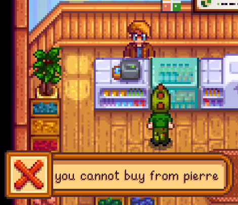

# Challenger

_A Mod for Stardew Valley_

- **Author:** [Stef Schulz](mailto:s.schulz@slothsoft.de)
- **Repository:** <https://github.com/slothsoft/stardew-challenger>
- **Open Issues:** <https://github.com/slothsoft/stardew-challenger/issues>

A mod for [Stardew Valley](https://www.stardewvalley.net/).

**Content of this ReadMe:**

- [Getting Started](#getting-started)
- [Developer Notes](#developer-notes)
- [License](#license)

## Getting Started

### Prerequisites

You need **[SMAPI](https://smapi.io/)** to run any kind of mods. And of course you need **[Stardew Valley](https://www.stardewvalley.net/)**.

### Installing

1. Install [SMAPI](https://smapi.io/)
1. Unzip this mod to the _mods/_ folder

### Using the Mod

The mod automatically hooks into the game.

## Developer Notes

_(This section contains notes to myself.)_

### Starting Development

To start developing this mod, you need to

1. Create [stardewvalley.targets](https://github.com/Pathoschild/SMAPI/blob/develop/docs/technical/mod-package.md#custom-game-path) file with the game folder

### Open To Dos

- create mod API
- create magical challenge item that will change according to the selected challenge
- create restriction for buying some kind of object
- create restriction that renames objects
- create restriction that allows for planting seeds out of season
- create restriction that allows all plants for mixed seeds
- create restriction to not be able to buy some objects from Robin
- create restriction on selling items
- create restriction to add items to a shops inventory

### Used Tutorials

- How to create first mod: [Modding:Modder Guide/Get Started](https://stardewvalleywiki.com/Modding:Modder_Guide/Get_Started)
- How to do some common tasks: [Modding:Common tasks](https://stardewvalleywiki.com/Modding:Common_tasks)
- SMAPI API: [Modding:Modder Guide/APIs](https://stardewvalleywiki.com/Modding:Modder_Guide/APIs)
- Stardew Valley API: [StawdewValley on GitHub](https://github.com/AdamMcIntosh/StawdewValley)

## License

This project is licensed under the MIT License - see the [MIT license](LICENSE) for details.