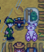
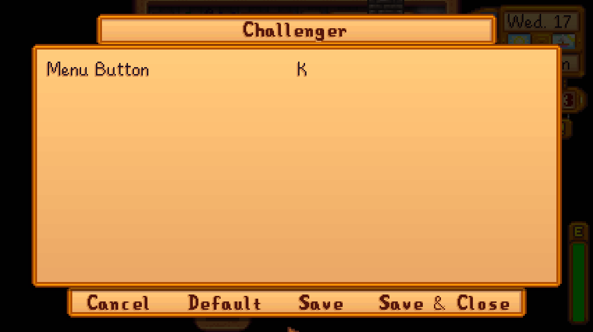

# Challenger

_A Mod for [Stardew Valley](https://www.stardewvalley.net/)_

[](LICENSE)

- **Author:** [Stef Schulz](mailto:s.schulz@slothsoft.de)
- **Repository:** <https://github.com/slothsoft/stardew-challenger>
- **Open Issues:** <https://github.com/slothsoft/stardew-challenger/issues>

A mod that makes playing a challenge again. It allows you to select a challenge from a list, 
which restricts some parts of the game and lets you focus on another part.


**Content of this ReadMe:**

- **[User Manual](#user-manual)**
    - [Prerequisites](#prerequisites)
    - [Installing](#installing)
    - [Removing the Mod](#removing-the-mod)
    - [Using the Mod](#using-the-mod)
        - [No Challenge](#no-challenge)
        - [Brewery](#brewery)
        - [Hermit](#hermit)
        - [No Capitalist](#no-capitalist)
        - [Vineyard](#vineyard)
    - [Configuration](#configuration)
    - [Versions](#versions)
- **[Translator Guide](#translator-guide)**
- **[Developer Notes](#developer-notes)**
- **[License](#license)**


## User Manual

### Prerequisites

You need **[SMAPI](https://smapi.io/)** to run any kind of mods. And of course you need
**[Stardew Valley](https://www.stardewvalley.net/)**.


### Installing

1. Install [SMAPI](https://smapi.io/)
1. Unzip the latest _[Challenger.zip](https://github.com/slothsoft/stardew-challenger/releases/latest)_ to the _Mods/_ folder
1. If you want to use spacechase0's [Generic Mod Config Menu](https://www.nexusmods.com/stardewvalley/mods/5098), this mod automatically hooks into its menu
1. If you want to use Pathoschild's [Automate](https://www.nexusmods.com/stardewvalley/mods/1063), unzip the _[ChallengerAutomate.zip](https://github.com/slothsoft/stardew-challenger/releases/latest)_, too


### Removing the Mod



1. Just remove the _Challenger/_ folder (and _ChallengerAutomate/_ if you have it).
1. If you have a **Magical Challenge Object**™ on your map, it should revert to a pink plush bunny
1. If you experienced bugs with the mod, please take the time to [report them](https://github.com/slothsoft/stardew-challenger/issues)


### Using the Mod

The mod is automatically present in the game. You will get an mail with the **Magical Challenge Object**™
the next time you wake up.


Using the attached object in its unmodified form will open the challenge menu. You can also open the menu using the
key [K] (you can customize the key in either the mod's config file or the [GenericModConfigMenu](https://www.nexusmods.com/stardewvalley/mods/5098)).


This will display all the restrictions you have to face - but you might get a little something extra to
make the challenge possible. The **Magical Challenge Object**™ will turn into this "something extra" once you
start the challenge and can be used as any other object of the kind it turns into.

This mod brings the following challenges:

- [No Challenge](#no-challenge)
- [Brewery](#brewery)
- [Hermit](#hermit)
- [No Capitalist](#no-capitalist)
- [Vineyard](#vineyard)

#### No Challenge

- default value without any restrictions - for when you are sick and tired of following rules


#### Brewery

**Goal:** To earn 5.000.000 gold by selling beer

- rice juice is renamed to rice beer
- only beers (including the new rice beer) count towards the goal
- you can only buy seeds for plants that make beer (which includes rice)
- you cannot build animal buildings, i.e. coop, barn and silo


#### Hermit

**Goal:** To finish the community center

- You cannot leave the farm, except on Sundays


#### No Capitalist

**Goal:** To finish the community center

- You cannot buy from Pierre, Clint or the Joja Mart (upgrading tools and opening geodes at Clint's is still possible though)
- You get a seed maker to tide you over your imminent lack of seeds


#### Vineyard

**Goal:** To earn 5.000.000 gold by selling wine

- rice juice is renamed to rice wine
- only wine and mead (and the new rice wine) count towards the goal
- you can only buy seeds for plants that make wine (which includes rice)
- you cannot build animal buildings, i.e. coop, barn and silo


### Configuration

If you wish to configure this mod, it's advised to install spacechase0's
[Generic Mod Config Menu](https://www.nexusmods.com/stardewvalley/mods/5098). Then there will be a config
page.



But if you wish to change the _config.json_ file manually, you can also do that. The _config.json_ with all
entries is:

```json
{
     "ButtonOpenMenu": "K"
}
```

| Key in JSON      | Config Name | Default Value | Explanation                                                                                       |
|------------------|-------------|---------------|---------------------------------------------------------------------------------------------------|
| `ButtonOpenMenu` | Menu Button | K             | The button to use when you want to open the menu to select the challenge or observe your progress |


### Versions

| Version | Issues                                                                          | Changes                                                                                                                                 |
|---------|---------------------------------------------------------------------------------|-----------------------------------------------------------------------------------------------------------------------------------------|
| Future  | [Issues](https://github.com/slothsoft/stardew-challenger/milestone/4)           |                                                                                                                                         |
| 0.5.0   | [Issues](https://github.com/slothsoft/stardew-challenger/milestone/10?closed=1) | Difficulty                                                                                                                              |
| 0.4.3   | [Issues](https://github.com/slothsoft/stardew-challenger/milestone/9?closed=1)  | Release Blockers II                                                                                                                     |
| 0.4.2   | [Issues](https://github.com/slothsoft/stardew-challenger/milestone/8?closed=1)  | Release Blockers                                                                                                                        |
| 0.4.1   | [Issues](https://github.com/slothsoft/stardew-challenger/milestone/7?closed=1)  | 2nd Alpha Test Bugfixes                                                                                                                 |
| 0.4.0   | [Issues](https://github.com/slothsoft/stardew-challenger/milestone/6?closed=1)  | After play testing version 0.2.x and 0.3.x it turned out the challenges have some mayor flaws - so mod was revamped to make it playable |
| 0.3.1   | [Issues](https://github.com/slothsoft/stardew-challenger/milestone/3?closed=1)  | Fix of the most glaring bugs                                                                                                            |
| 0.3.0   | [Issues](https://github.com/slothsoft/stardew-challenger/milestone/5?closed=1)  | More challenges                                                                                                                         |
| 0.2.0   | [Issues](https://github.com/slothsoft/stardew-challenger/milestone/2?closed=1)  | Alpha test                                                                                                                              |
| 0.1.0   | [Issues](https://github.com/slothsoft/stardew-challenger/milestone/1?closed=1)  | Proof of concept                                                                                                                        |

_(All issues can be found [here](https://github.com/slothsoft/stardew-challenger/issues).)_


## Translator Guide

Right now, not all translations are provided. If you want to help, translate either file in the _[i18n/](Challenger/i18n/)_
and test it right in your Stardew Valley (the same folder exists in your _Mods/_ folder). You can than provide it
to me via [pull request](https://github.com/slothsoft/stardew-challenger/fork) or [email](mailto:s.schulz@slothsoft.de).

| Key       | Language  | Translated? |
|-----------|-----------|-------------|
| `default` | English   |  ✅  |
| `de`      | German    |  ✅  |
| `es`      | Spanish   |             |
| `fr`      | French    |             |
| `hu`      | Hungarian |             |
| `it`      | Italian   |             |
| `ko`      | Korean    |             |
| `pt`      | Portugese |             |
| `ru`      | Russian   |             |
| `tr`      | Turkish   |             |
| `zh`      | Chinese   |             |


## Developer Notes

Can be found [here](readme/dev-notes.md).


## License

This project is licensed under the MIT License - see the [MIT license](LICENSE) for details.