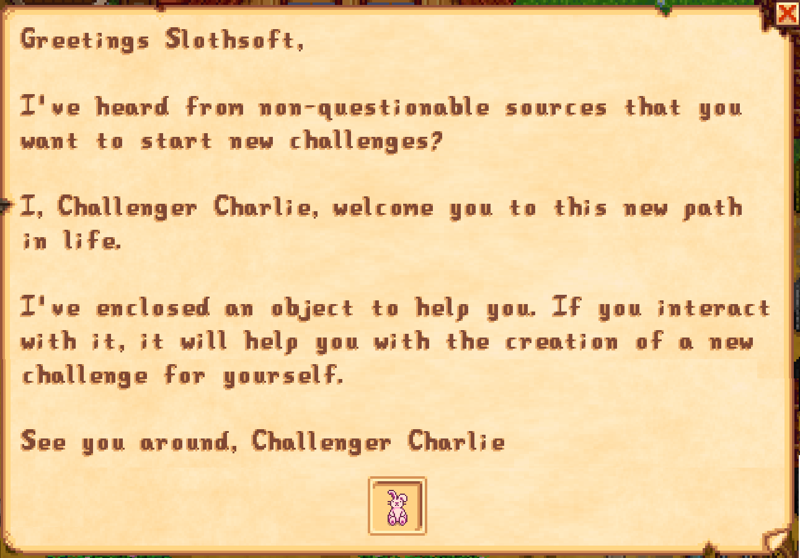

# Challenger

_A Mod for Stardew Valley_

[](LICENSE)

- **Author:** [Stef Schulz](mailto:s.schulz@slothsoft.de)
- **Repository:** <https://github.com/slothsoft/stardew-challenger>
- **Open Issues:** <https://github.com/slothsoft/stardew-challenger/issues>

A mod for [Stardew Valley](https://www.stardewvalley.net/) that makes playing a challenge again. 
It allows you to select a challenge from a list, which restricts some parts of the game and let's you
focus on another part.


**Content of this ReadMe:**

- **[User Manual](#user-manual)**
  - [Prerequisites](#prerequisites)
  - [Installing](#installing)
  - [Using the Mod](#using-the-mod)
    - [No Challenge](#no-challenge)
    - [No Capitalist](#no-capitalist)
    - [Vinyard](#vinyard)
  - [Versions](#versions)
- **[Translator Guide](#translator-guide)**
- **[Developer Notes](#developer-notes)**
- **[License](#license)**


## User Manual

### Prerequisites

You need **[SMAPI](https://smapi.io/)** to run any kind of mods. And of course you need 
**[Stardew Valley](https://www.stardewvalley.net/)**.


### Installing

1. Install [SMAPI](https://smapi.io/)
1. Unzip this mod to the _Mods/_ folder


### Using the Mod

The mod automatically hooks into the game. You will get an mail with the **Magical Challenge Object**™ 
the next time you wake up:



Using this object in its unmodified form will open the challenge menu. You can also open the menu using the
key [K] (you can customize the key in either the mod's config file or the [GenericModConfigMenu](https://github.com/spacechase0/StardewValleyMods/tree/develop/GenericModConfigMenu)).


This will display all the restrictions you have to face - but you might get a little something extra to 
make the challenge possible. The **Magical Challenge Object**™ will turn into this "something extra" once you
start the challenge and can be used as any other object of the kind it turns into.

This mod brings the following challenges:

- [No Challenge](#no-challenge)
- [No Capitalist](#no-capitalist)
- [Vinyard](#vinyard)

#### No Challenge

- default value without any restrictions - for when you are sick and tired of following rules

#### No Capitalist

- You cannot buy from Pierre, Clint or the Joja Mart (upgrading tools and opening geodes at Clint's is still possible though)
- You get a seed maker to tide you over your imminent lack of seeds

#### Vinyard

- rice juice is renamed to rice wine
- you can only sell wine and mead (which includes the new rice wine)
- you can only buy seeds for plants that make wine (which includes rice)
- you cannot build animal buildings, i.e. coop, barn and silo

### Versions

| Version | Issues | Changes          |
|---------| ------ |------------------|
| Future  | [Issues](https://github.com/slothsoft/stardew-challenger/milestone/4) |                  |
| 0.2.0   | [Issues](https://github.com/slothsoft/stardew-challenger/milestone/2?closed=1) | Alpha test |
| 0.1.0   | [Issues](https://github.com/slothsoft/stardew-challenger/milestone/1?closed=1) | Proof of concept |

_(All issues can be found [here](https://github.com/slothsoft/stardew-challenger/issues).)_


## Translator Guide

Right now, not all translations are provided. If you want to help, translate either file in the _[i18n/](Challenger/i18n/)_
and test it right in your Stardew Valley (the same folder exists in your _Mods/_ folder). You can than provide it
to me via [pull request](https://github.com/slothsoft/stardew-challenger/fork) or [email](mailto:s.schulz@slothsoft.de).

| Key       | Language  | Translated? |
|-----------|-----------|-------------|
| `default` | English   |  ✅  |
| `de`      | German    |  ✅  |
| `es`      | Spanish   |             |
| `fr`      | French    |             |
| `hu`      | Hungarian |             |
| `it`      | Italian   |             |
| `ko`      | Korean    |             |
| `pt`      | Portugese |             |
| `ru`      | Russian   |             |
| `tr`      | Turkish   |             |
| `zh`      | Chinese   |             |


## Developer Notes

_(This section contains notes to myself.)_

### Starting Development

To start developing this mod, you need to

1. Create [stardewvalley.targets](https://github.com/Pathoschild/SMAPI/blob/develop/docs/technical/mod-package.md#custom-game-path) file with the game folder

### Release

1. Check that all the versions are correct (see point 5)
2. Run _build.bat_, which only really works on my PC, but so what: 
```bat
.\build x.x.x
```
3. Put the contents of _bin/Challenger.zip_ in a fresh Stardew Valley and test if everything works
4. Create a new tag and release on GitHub, append the ZIP
5. Increment the version in _manifest.json_ and _Challenger.csproj_

### Used Tutorials

- **General Information:**
  - SMAPI API: [Modding:Modder Guide/APIs](https://stardewvalleywiki.com/Modding:Modder_Guide/APIs)
  - Stardew Valley API: [StawdewValley on GitHub](https://github.com/veywrn/StardewValley)
- **Other Mods:**
  - [Sonozuki's Mods](https://github.com/Sonozuki/StardewMods)
  - [Pathoschild's Mods](https://github.com/Pathoschild/StardewMods/tree/stable)
  - [spacechase0's Mods](https://github.com/spacechase0/StardewValleyMods) (JsonAssets)
  - [Digus's Mods](https://github.com/Digus/StardewValleyMods)
  - [Dan Volchek's Mods](https://github.com/danvolchek/StardewMods)
  - [ImJustMatt's Mods](https://github.com/ImJustMatt/StardewMods) (Ordinary Capsule)
  - [Platonymous's Mods](https://github.com/Platonymous/Stardew-Valley-Mods) (Arcade Machines)


## License

This project is licensed under the MIT License - see the [MIT license](LICENSE) for details.