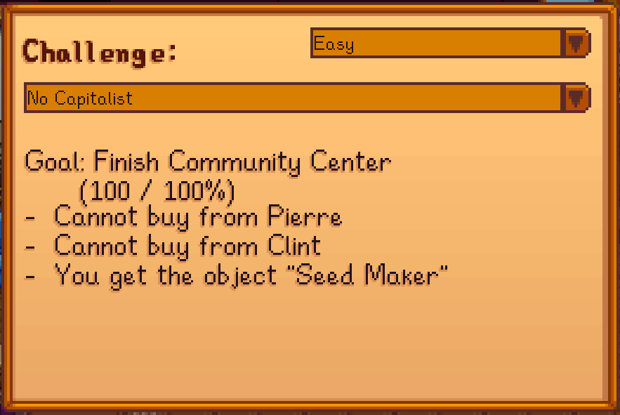

# Challenger

_A Mod for Stardew Valley_

- **Author:** [Stef Schulz](mailto:s.schulz@slothsoft.de)
- **Repository:** <https://github.com/slothsoft/stardew-challenger>
- **Open Issues:** <https://github.com/slothsoft/stardew-challenger/issues>

A mod for [Stardew Valley](https://www.stardewvalley.net/).

**Content of this ReadMe:**

- [Getting Started](#getting-started)
- [Developer Notes](#developer-notes)
- [License](#license)

## Getting Started

### Prerequisites

You need **[SMAPI](https://smapi.io/)** to run any kind of mods. And of course you need 
**[Stardew Valley](https://www.stardewvalley.net/)**.

### Installing

1. Install [SMAPI](https://smapi.io/)
1. Unzip this mod to the _mods/_ folder

### Using the Mod

The mod automatically hooks into the game. You will get an mail with the **Magical Challenge Object**™ 
the next time you wake up:

Using this object in its unmodified form will open the challenge menu.

This will display all the restrictions you have to face - but you might get a little something extra to 
make the challenge possible. The **Magical Challenge Object**™ will turn into this "something extra" once you
start the challenge and can be used as any other object of the kind it turns into.

## Developer Notes

_(This section contains notes to myself.)_

### Starting Development

To start developing this mod, you need to

1. Create [stardewvalley.targets](https://github.com/Pathoschild/SMAPI/blob/develop/docs/technical/mod-package.md#custom-game-path) file with the game folder

### Used Tutorials

- **General Information:**
  - SMAPI API: [Modding:Modder Guide/APIs](https://stardewvalleywiki.com/Modding:Modder_Guide/APIs)
  - Stardew Valley API: [StawdewValley on GitHub](https://github.com/veywrn/StardewValley)
- **Other Mods:**
  - [Sonozuki's Mods](https://github.com/Sonozuki/StardewMods)
  - [Pathoschild's Mods](https://github.com/Pathoschild/StardewMods/tree/stable)
  - [spacechase0's Mods](https://github.com/spacechase0/StardewValleyMods) (JsonAssets)
  - [Digus's Mods](https://github.com/Digus/StardewValleyMods)
  - [Dan Volchek's Mods](https://github.com/danvolchek/StardewMods)
  - [ImJustMatt's Mods](https://github.com/ImJustMatt/StardewMods) (Ordinary Capsule)
  - [ImJustMatt's Mods](https://github.com/Platonymous/Stardew-Valley-Mods) (Arcade Machines)

## License

This project is licensed under the MIT License - see the [MIT license](LICENSE) for details.